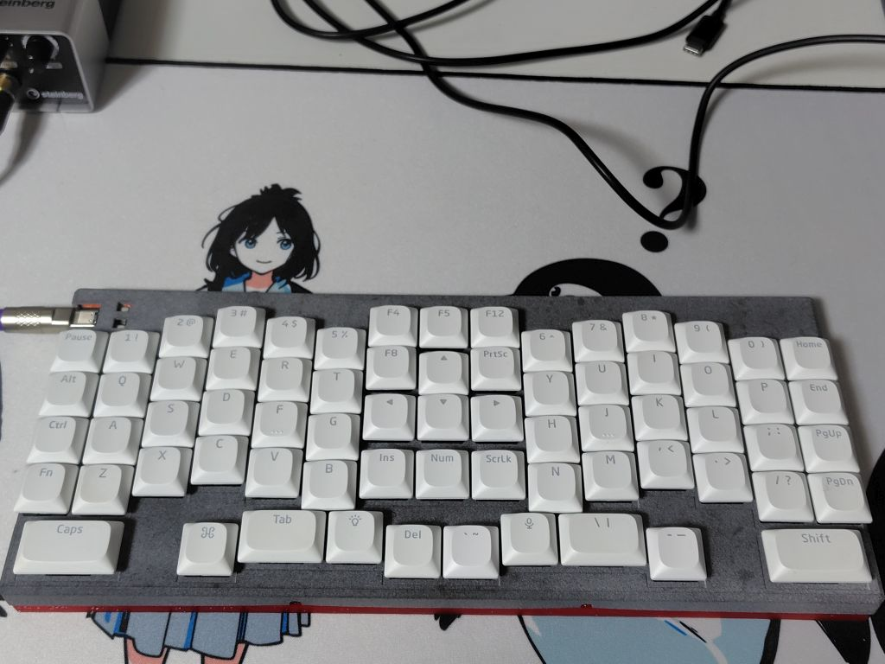

# COLF

COLF is a keyboard for ChocV2 with 2 pins and LED slit.
  

- ChocV2 with 2 pins and LED slit only
- angle: -2 or 2
- 70 keys
- PA12 Topcase
- TPU Middle and Tilt plates
- 2 palm buttons
- Left YHN and Right TGB layout

## About Firmware

This keyboard is running on QMK firmware.  
https://github.com/qmk/qmk_firmware  

## Build Guide

https://tijikusen.hatenablog.com/entry/buildguide_colf
